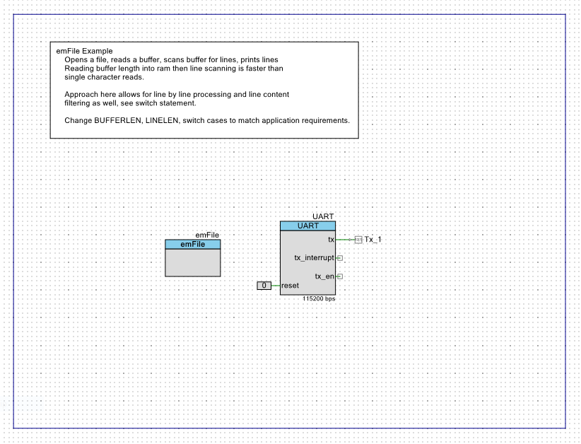
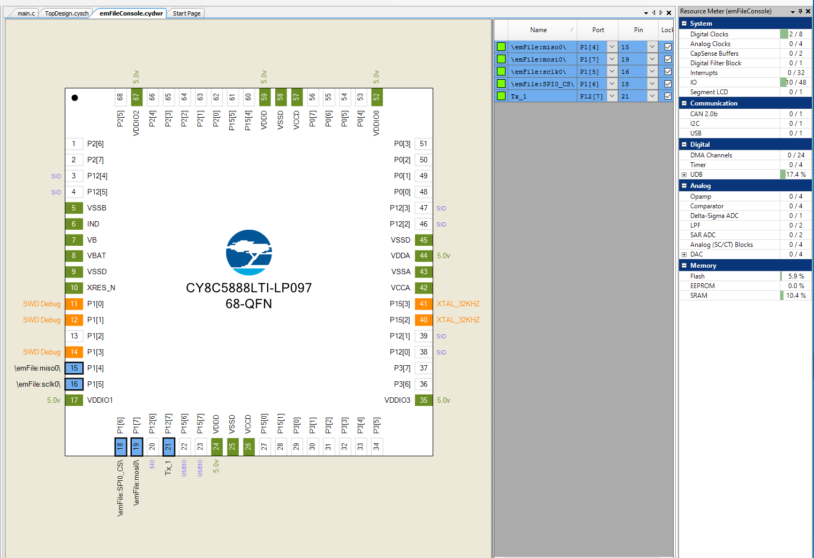
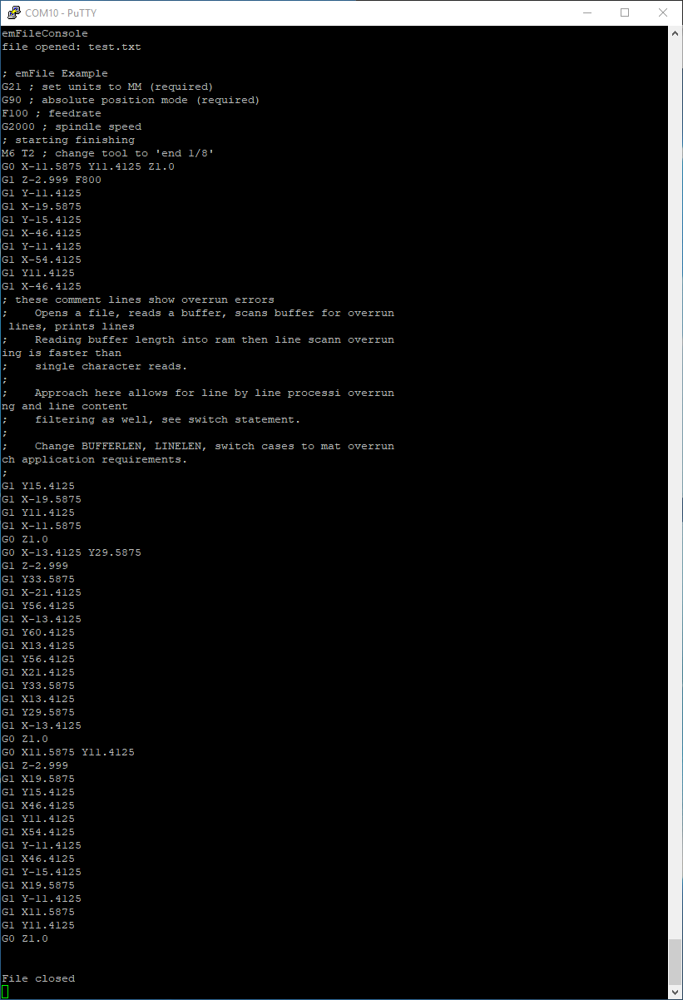

# psoc5EmFileExample
PSoC5 SD Read example project using emFile component

Opens a file, reads a buffer, scans buffer for lines, prints lines
Reading buffer length into ram then line scanning is faster than 
single character reads. 

Approach here allows for line by line processing and line content 
filtering as well, see switch statement.

Reads "test.txt" from fat32 SD card.

Change BUFFERLEN, LINELEN, switch cases to match application requirements.

see UM02001.pdf, UM02001 User Guide & Reference Manual for emFile Segger
https://www.segger.com/downloads/emfile/UM02001

